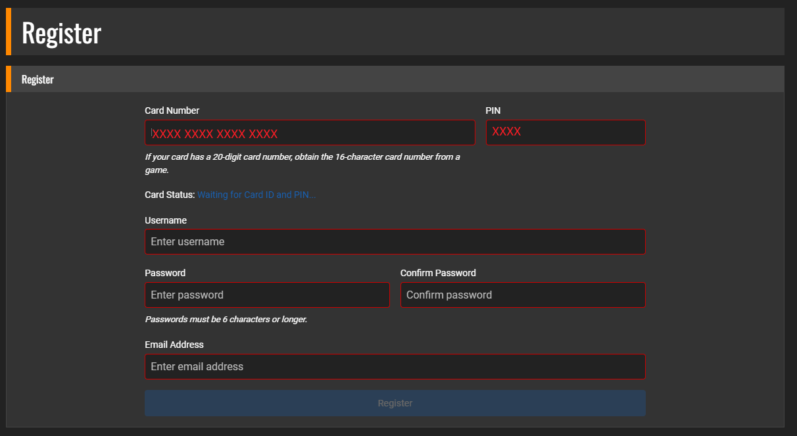
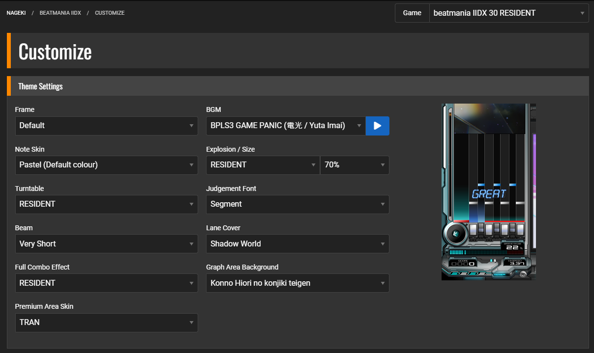

# 
PERSONALIZACIÓN

!!! question "Preguntas a responder"
    ¿Cómo puedo personalizar mi perfil de IIDX?

Ya que tenemos el perfil listo, podemos registrarnos en el servidor y
acceder a más ventajas!

━━━━━━━━━━━━━━━━━ ◦ ❖ ◦ ━━━━━━━━━━━━━━━━━

## 
PERSONALIZAR PERFIL

━━━━━━━━━━━━━━━━━ ◦ ❖ ◦ ━━━━━━━━━━━━━━━━━

Para ésto, debemos ingresar a [este link](https://nageki-cg.net/) y nos
dirigimos a la opción **Register**.

Llenamos la información que aparece en la imagen:

-   Card Number: Es el **user code** que mencionamos anteriormente. Lo
    podemos obtener desde la pantalla de login en el juego:

-   PIN: Es el pin de 4 dígitos con el que nos registramos en la
    máquina.

-   Username: Elegimos un nombre de usuario para poder ingresar a la
    página. Recomendamos utilizar uno que sea fácil de recordar para
    ustedes. No necesariamente debe ser el mismo nombre que utilizan de
    DJ NAME.

-   Password: Elegimos una contraseña para ingresar. Debe tener 6
    caracteres o más.

-   Email Address: Recomendamos utilizar un correo al que siempre tengan
    acceso, ya que en caso de olvidar su contraseña, deberán
    proporcionarlo para poder recuperar el acceso a su cuenta.

<!-- -->

-   Una vez nos registramos y activamos nuestra cuenta, procedemos a
    ingresar a nuestra cuenta utilizando la pantalla de Login. Luego de
    eso, podremos ver la página:

Ahora, a los que nos convoca. Para personalizar nuestro perfil debemos
ingresar a la opción de BEATMANIA IIDX y luego a Customize.

## Personalización general 

Lo primero que debemos hacer es revisar que estamos en el juego
correcto. Actualmente estamos utilizando el IIDX 30 RESIDENT. Luego de
eso, nos encontramos con THEME SETTINGS. Podemos cambiar las opciones a
nuestro antojo, como también para guiarnos podemos utilizar el preview
que muestra a la derecha.

Luego, en GENERAL SETTINGS, podemos personalizar distintos ajustes sobre
el juego, como por ejemplo: Desactivar el preview de la música, lockear
el effector en un efecto en específico, cambiar el HI-SPEED al clásico,
etc.

También tenemos el Opt-In unlock, el cual te permite jugar los eventos y
desbloquear los temas, tal cual funciona en el servidor oficial.

Finalmente, en esta sección, tenemos las CATEGORY y PRIVACY SETTINGS,
las cuales más que nada tienen que ver con los RIVALS, de lo cual
hablaremos más adelante.

Y, finalmente, tenemos las QPRO SETTINGS, las cuales nos permiten
personalizar nuestro avatar dentro del juego. Además podemos guardar 4
presets, por si queremos ir turnando algunos avatar cada cierto tiempo.

