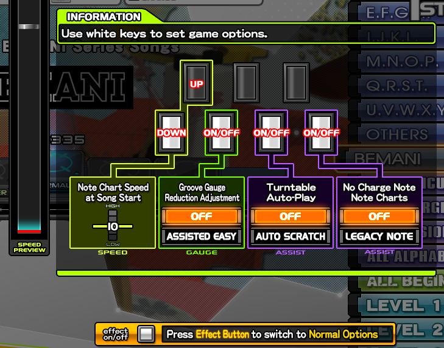
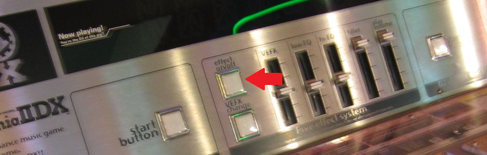
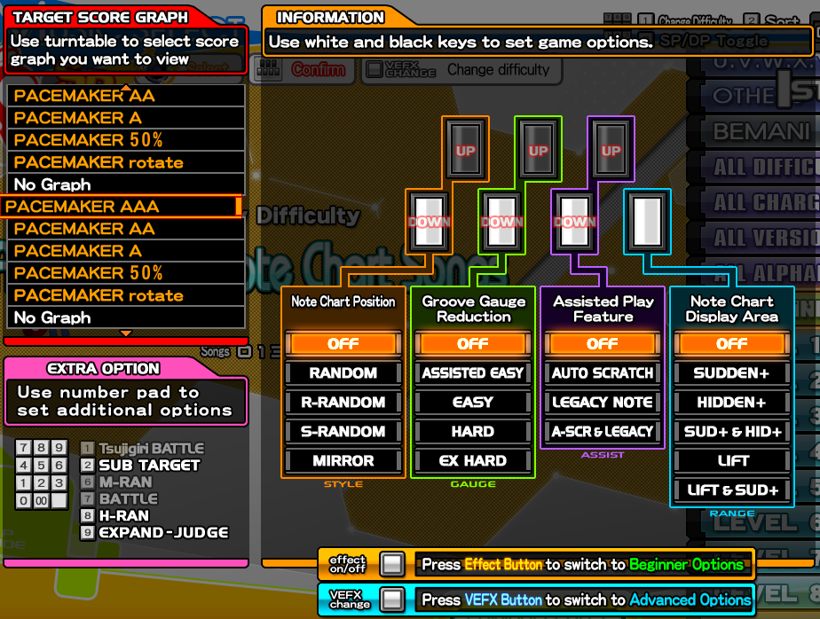
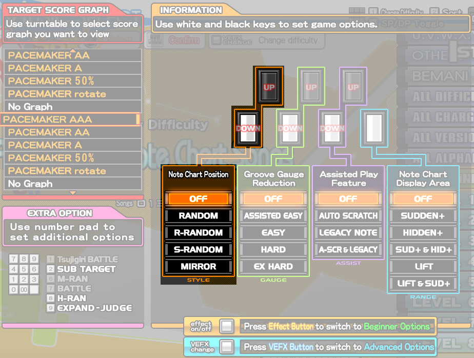
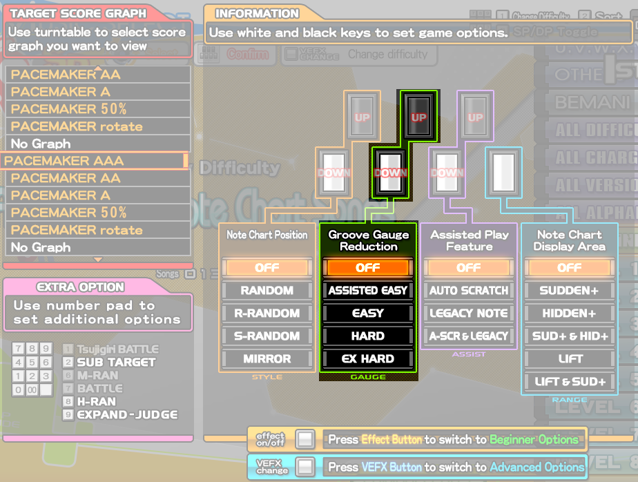
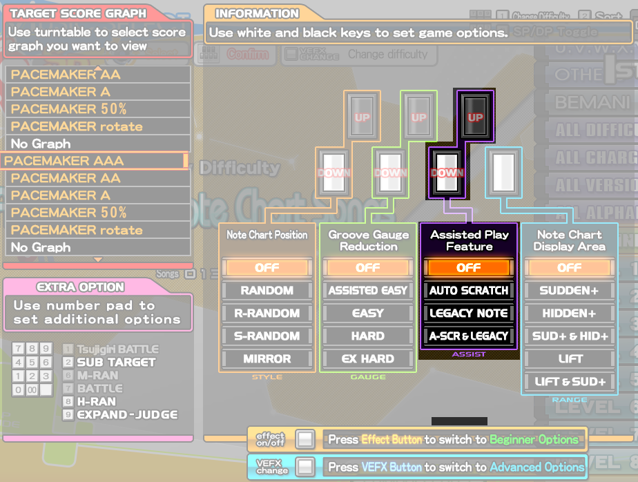
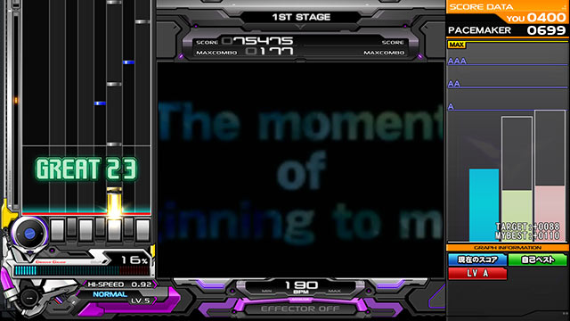
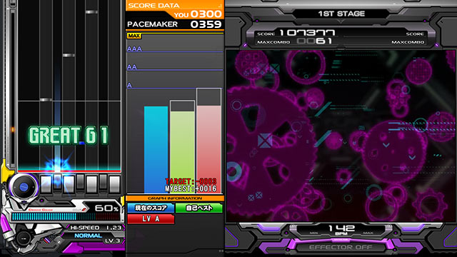

━━━━━━━━━━━━━━━━━ ◦ ❖ ◦ ━━━━━━━━━━━━━━━━━

# 
¿CUÁLES SON LAS OPCIONES DEL JUEGO Y CÓMO ACCEDO A ELLAS?

━━━━━━━━━━━━━━━━━ ◦ ❖ ◦ ━━━━━━━━━━━━━━━━━

> ¿Cuáles son las opciones del juego?. ¿Para qué sirven y cómo puedo
cambiarlas?

> ¿Quieres cambiar el tipo de chart?, ¿viste que alguien ajustó el timing
y también quieres hacerlo?. A continuación hablaremos sobre las opciones
disponibles, cómo afectan a tu juego y cómo usarlas a tu favor.

En el menú de selección de canción, al apretar el botón **START** te
encontrarás con lo siguiente:

-   Usando la teclera, puedes usar los botones según el esquema que nos
    muestra en la imagen.

    -   Tecla 1 y 2: Controlas la velocidad con la que aparecen las
        notas. Mientras mayor sea el número, más rápido irán las notas.

    -   Tecla 3: Puedes ajustar la barra. La posición **OFF** es la
        default (conocida como GROOVE GAUGE) y tienes la otra
        alternativa llamada ASSISTED EASY, recomendada para los que
        están recién comenzando.

    -   Tecla 5: Puedes activar o desactivar el uso del scratch/TT.

    -   Tecla 7: Puedes activar o desactivar el uso de Charge Notes
        (CN).

    Este menú se recomienda principalmente para jugadores nuevos, ya que
    trae las opciones esenciales para comenzar a familiarizarse con el
    juego.

> [!TIP]
> Si ya eres un jugador más experimentado, o simplemente eres curioso, puedes acceder al menú de opciones avanzadas presionando el botón EFFECT en la parte frontal de la máquina:
 

Con esto podremos abrir el menú de opciones avanzado y nos encontraremos
con la siguiente pantalla:

___
Iremos explicando por partes cómo funciona cada opción a continuación:

## Tecla 1-2: Podemos activar/desactivar la opción RANDOM o a sus variantes, las cuales explicaré rápidamente:

-   OFF: Jugaremos el chart \"original\", es decir, sin ningún cambio en
    su orden de teclas.

-   RANDOM: Las columnas se desordenarán en cualquier orden. Por
    ejemplo, el orden normal de un chart es 1234567 y RANDOM nos podría
    entregar patrones como 4653127 o 7546213, etc. Si bien las columnas
    cambian su orden, las notas que están en ellas siguen apareciendo en
    la misma columna.

-   R-RANDOM: Las columnas mantienen el orden de los números pero se
    separan en \"trozos\" (incluyendo MIRROR, de lo cual hablaremos más
    adelante). Siguiendo el mismo ejemplo de antes, un R-RANDOM nos
    puede entregar el orden 4567123 o 3456712, por ejemplo. Si considera
    MIRROR, también puede quedar como 4321765 o 5432176.

-   S-RANDOM: Las notas se desordenarán en cualquier orden, incluso sin
    depender de la columna. La cantidad de notas permanecerá igual, pero
    éstas no respetarán ningún orden de columnas y, por ende, pueden
    aparecer en cualquiera de éstas.

-   MIRROR: El orden del chart queda como en un espejo, es decir, de
    1234567 pasa a 7654321.

 

## Tecla 3-4: Podemos cambiar el tipo de barra con el que jugaremos la canción a elegir:

-   OFF: Jugaremos la canción con la GROOVE GAUGE, o la barra por
    defecto. Esta barra requiere un 80% como mínimo para considerar un
    tema como pasado.

-   ASSISTED EASY: Jugaremos la canción con ASSISTED EASY GAUGE. Esta
    barra requiere un 60% como mínimo para considerar un tema como
    pasado, como también te descuenta menos % de barra al perder una
    nota.

-   EASY: Jugaremos la canción con EASY GAUGE. Esta barra requiere un
    80% para considerar un tema como pasado, pero al fallar descuenta
    menor % de barra en comparación al GROOVE GAUGE (es decir, es una
    GROOVE GAUGE pero descuenta menos % en los fallos).

-   HARD: Jugaremos la canción con HARD GAUGE. Esta barra no requiere un
    % mínimo para considerar un tema como pasado, pero si pierdes la
    barra en su totalidad te botará del tema instantáneamente. Además,
    descuenta más % de barra en comparación a la GROOVE GAUGE.

-   EX HARD: Jugaremos la canción con EX HARD GAUGE. Esta barra funciona
    igual que la HARD GAUGE, pero descuenta bastante más % de barra al
    perder notas.

## Tecla 5-6: Podemos elegir distintos tipos de \"ayuda\" mientras jugamos.

-   AUTO SCRATCH: Los discos cambiarán de color a verde y se marcarán
    automáticamente.

-   LEGACY NOTE: Todos los Charge Notes (CN) cambiarán a notas normales.

-   A-SCR & LEGACY: Ambas opciones juntas (AUTO SCRATCH y LEGACY NOTE).

## Tecla 7: Podemos elegir distintas visualizaciones para acomodar lo mejor posible nuestro gameplay. Lo más común es utilizar SUDDEN+, o también LIFT, o ambas.

-   SUDDEN+: Nos desplegará un LANE COVER desde la parte superior de la
    pantalla. Lo podemos ajustar manteniendo presionada la tecla START y
    girando el disco.

-   HIDDEN+: Nos desplegará un LANE COVER desde la parte inferior de la
    pantalla. Se ajusta de la misma forma que el SUDDEN+.

-   SUD+ & HID+: Ambas opciones juntas, es decir, tendremos un LANE
    COVER tanto en la parte superior como en la inferior.

-   LIFT: Es muy similar al HIDDEN+, pero la diferencia es que moverá la
    \"judgement line\", es decir, la línea roja donde debemos presionar
    las notas. Usualmente ésto se usa cuando quieres tener el gameplay
    más arriba para más comodidad a la hora de jugar.

-   LIFT & SUD+: Activa la opción LIFT y SUDDEN+ juntas.

Para ajustar tanto el HIDDEN+ como el LIFT, debemos desactivar
temporalmente la opción SUDDEN+ presionando rápidamente el botón START
dos veces, ajustamos con el disco mientras mantenemos el START y luego
volvemos a activar SUDDEN+ presionando nuevamente el botón START dos
veces.

### PACEMAKER: Podemos activar un gráfico que se mostrará del lado opuesto de la pantalla al que estamos jugando. Se utiliza frecuentemente para comparar en tiempo real el cómo vamos jugando en comparación a lo que hayamos seleccionado.

-   PACEMAKER AAA/AA/A: Nos comparará nuestro puntaje actual contra un
    puntaje \"esperado\" para conseguir la calificación deseada.

    PACEMAKER NEXT/NEXT+: Nos comparará nuestro puntaje actual frente a
    un puntaje un poco mejor que el que ya teníamos en la canción.

    El resto de opciones sirven para comparar de otras formas, pero ya
    queda en ustedes descubrir cómo funcionan y si les acomoda. Además,
    al activar el PACEMAKER veremos 3 barras de colores, en las cuales
    veremos 3 puntajes distintos:

    -   BARRA AZUL: Nuestro puntaje actual.

    -   BARRA VERDE: Nuestro mejor puntaje, conocido como Personal Best
        (PB)

    -   BARRA ROJA: Es el PACEMAKER que elegimos previamente.

Además, puedes presionar la tecla START del lado contrario para cambiar
la posición del gráfico. Es decir, si juegas en el PLAYER 1 (lado
izquierdo) puedes presionar la tecla START del PLAYER 2 para cambiar el
gráfico de posición y viceversa. El gráfico en otra posición queda tal
cual lo muestra la siguiente imagen:

