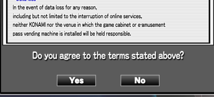

# 
PERFILES

!!! question "Preguntas a responder"
    - ¿Cómo puedo crear mi propio perfil para jugar en Diana?

Aquí te daremos una breve explicación sobre cómo crear tu perfil para
jugar en el IIDX de Diana. Crear tu perfil trae muchos beneficios, entre
ellos:

-   Personalizar visualmente el juego

-   Guardar tu progreso y tus puntajes

-   Agregar rivales para comparar tus puntajes con otros jugadores

-   Tener acceso a los Dan más altos (de 9th hacia arriba)

A continuación dejamos una guía sobre los pasos a seguir:

━━━━━━━━━━━━━━━━━ ◦ ❖ ◦ ━━━━━━━━━━━━━━━━━

## 
 **TIPOS DE TARJETAS VALIDAS**

━━━━━━━━━━━━━━━━━ ◦ ❖ ◦ ━━━━━━━━━━━━━━━━━

Lo primero que debes tomar en cuenta es que sólo funcionan algunas
tarjetas en específico, entre ellas, te sugerimos las siguientes:

| KONAMI e-amusement pass Actual | KONAMI e-amusement pass Antigua |    ANDAMIRO AM-PASS    |     SEGA AIME CARD     |
| :----------------------------: | :-----------------------------: | :--------------------: | :--------------------: |
|          |           |  |  |

---

━━━━━━━━━━━━━━━━━ ◦ ❖ ◦ ━━━━━━━━━━━━━━━━━

## 
REGISTRAR PERFIL

━━━━━━━━━━━━━━━━━ ◦ ❖ ◦ ━━━━━━━━━━━━━━━━━

Luego de tener una tarjeta apta para el juego, procedemos a registrar
nuestro perfil en la máquina. Para esto, debemos ingresar nuestra
tarjeta en los lectores de la máquina (marcados en naranjo)

El juego nos mostrará la siguiente pantalla, en la cual debemos aceptar
los términos y condiciones de uso para continuar. Con el disco puedes
cambiar la opción, y con las teclas blancas (las de abajo en la teclera)
confirmas tu decisión.

Continuando con el proceso, debemos crear un PIN para nuestro perfil, el
cual debes ingresar dos veces usando la teclera numérica que está sobre
la ranura donde ingresaste la tarjeta. Este código debes recordarlo, ya
que cada vez que pongas tu tarjeta debes introducir tu PIN para ingresar
a tu perfil.

Además, te sugerimos tomarle una foto al código de 16 dígitos que sale
bajo el PIN (el que sale descrito como \"**user code**\"), ya que lo
utilizaremos más tarde en otro proceso.

Luego debes elegir el nombre para tu perfil. Para controlar este menú,
debes utilizar el disco para cambiar la letra/número/símbolo, como
también utilizas las teclas blancas para confirmar el carácter que
quieras utilizar. Si pusiste mal alguno, puedes ir a la opción BACK para
borrar el último que hayas puesto, o también puedes utilizar las teclas
negras para ésto.

El nombre puedes cambiarlo más tarde desde la página del servidor.

Luego escogemos el área a la que pertenecemos, aunque ésto no se utiliza
mucho en nuestro caso. Esta parte no está traducida, por ende te dejamos
algunas sugerencias de lugares fuera de Japón que salen en la tabla:

| Nombre en Japonés | Traducción                         |
| ----------------- | ---------------------------------- |
| 韓国              | **Corea / Corea del sur**          |
| タイ              | **Tailandia**                      |
| インドネシア      | **Indonesia**                      |
| シンガポール      | **Singapur**                       |
| フィリピン        | **Filipinas**                      |
| マカオ            | **Macao**                          |
| アメリカ          | **Norte América / Estados Unidos** |
| オーストラリア    | **Australia**                      |
| ニュージーランド  | **Nueva Zelanda**                  |
| 海外              | **Extranjero**                     |

!!! info "Info adicional"
    El restos de los nombres que aparecen en el juego son solo ciudades que hay en Japón.

Como dijimos antes, en nuestro caso esto no tiene ninguna utilidad y sólo
funciona como decoración.

Finalmente, luego de crear tu perfil ya ingresas a la parte de selección
de modos. Si estás recien comenzando, puedes jugar el modo de STEP-UP,
el cual te sugerirá canciones a medida que vayas progresando. En caso de
que prefieras jugar el modo más común, selecciona STANDARD.

Cuando seleccionas el modo, si no hay créditos, la máquina te pedirá
poner un crédito utilizando tu tarjeta. Luego de eso, te preguntará si
deseas probar el tutorial del juego. Seleccionas la opción deseada y
continúas con el juego.

