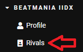
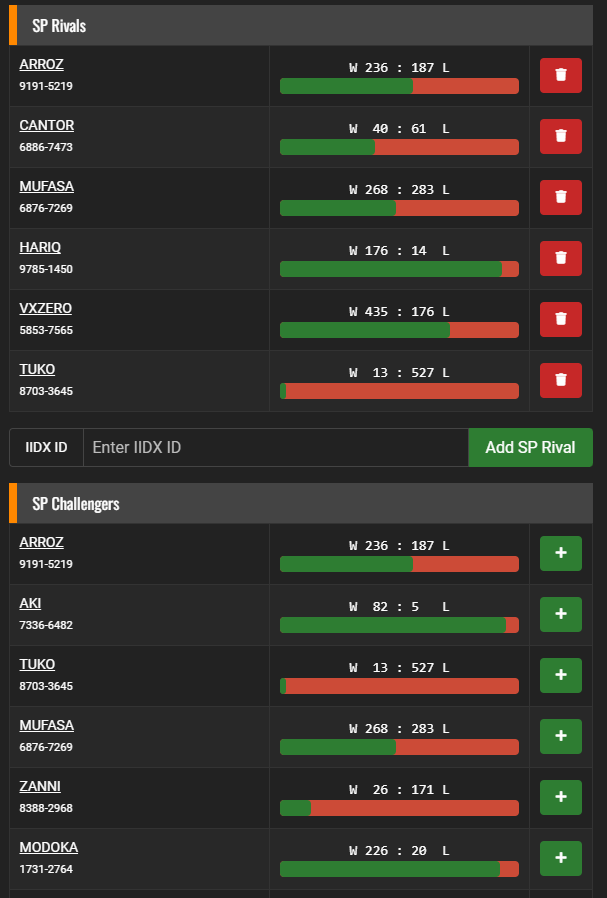
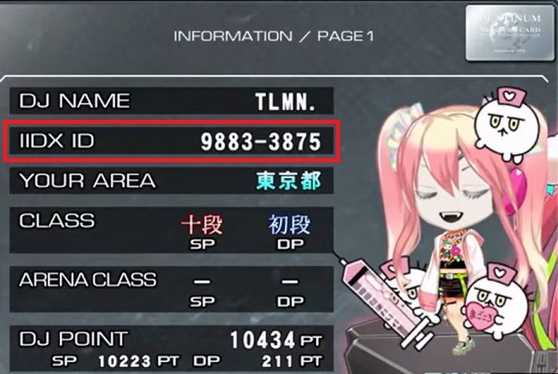

# 
RIVALES

!!! question "Preguntas a responder"
    ¿Qué son los rivales?. ¿Cómo puedo utilizar esta función?

Ya que nos registramos en la página (WEBUI) del servidor, podemos
utilizar la función de RIVALS. Ésto nos permite agregar a otros
jugadores a nuestro perfil, para así poder comparar puntajes en tiempo
real, como también para ver los clear lamp/scores de ellos en cada
canción del juego.

━━━━━━━━━━━━━━━━━ ◦ ❖ ◦ ━━━━━━━━━━━━━━━━━

## 
AÑADIR RIVALES

━━━━━━━━━━━━━━━━━ ◦ ❖ ◦ ━━━━━━━━━━━━━━━━━

Para agregar rivales, debemos seguir los siguientes pasos: Ingresamos a
la página del servidor, luego vamos a BEATMANIA IIDX y finalmente a
**Rivals**.

Aquí nos encontramos con varios campos, los cuales explicaremos a
continuación:

-   Primero, nos encontramos con SP y DP. Ésto es porque podemos agregar
    rivales tanto como para Single Play (SP) como para Double Play (DP)
    y, por lo tanto, no necesariamente deben ser los mismos para ambos
    modos.

-   Luego, ya nos encontramos con Rivals y Challengers. Los **Rivals**
    son los jugadores que nosotros tenemos agregados y los
    **Challengers** son los jugadores que nos agregaron a su lista de
    rivales.

-   Utilizando el botón **+** podemos agregar rápidamente a los
    challengers a nuestros rivales, como también podemos usar el botón
    rojo para poder borrar a los rivals que tengamos agregados.

-   Debemos además considerar que como máximo podemos agregar 6 rivales.

Ahora, si queremos agregar rivales de forma manual, necesitamos el IIDX
ID del jugador, el cual lo podemos obtener de dos formas:

-   Podemos preguntarle directamente al jugador su IIDX ID.

-   Podemos buscarlo en la sección \"Players\" del WEBUI del servidor,
    utilizando el DJ NAME del jugador como filtro.

Además, para obtener nuestro IIDX ID podemos buscarlo también de dos
formas:

-   Ingresando al WEBUI del servidor, luego yendo a la opción
    **Profile** dentro de la sección de BEATMANIA IIDX.

-   Revisarlo al momento de ingresar la tarjeta a la máquina, luego de
    poner el perfil.

