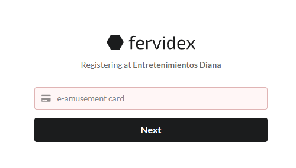
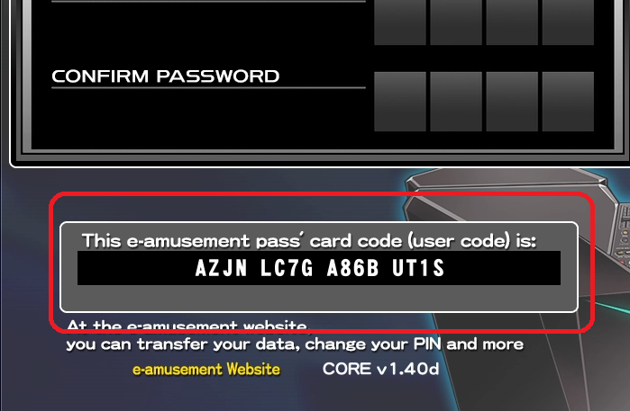
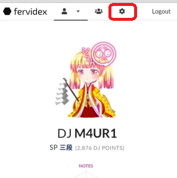
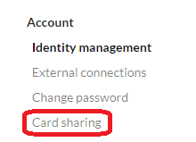
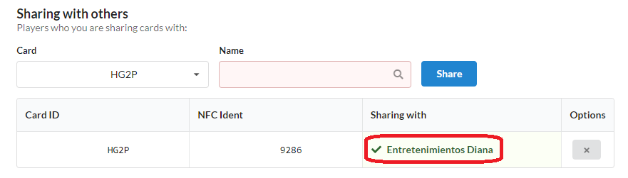
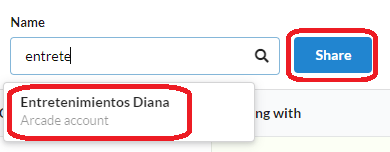
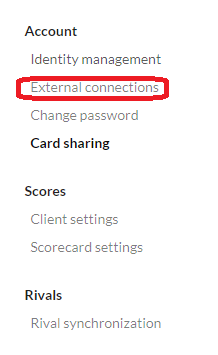
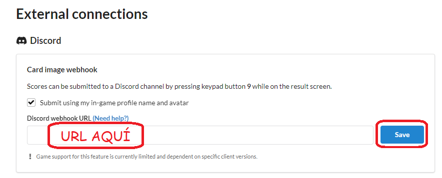
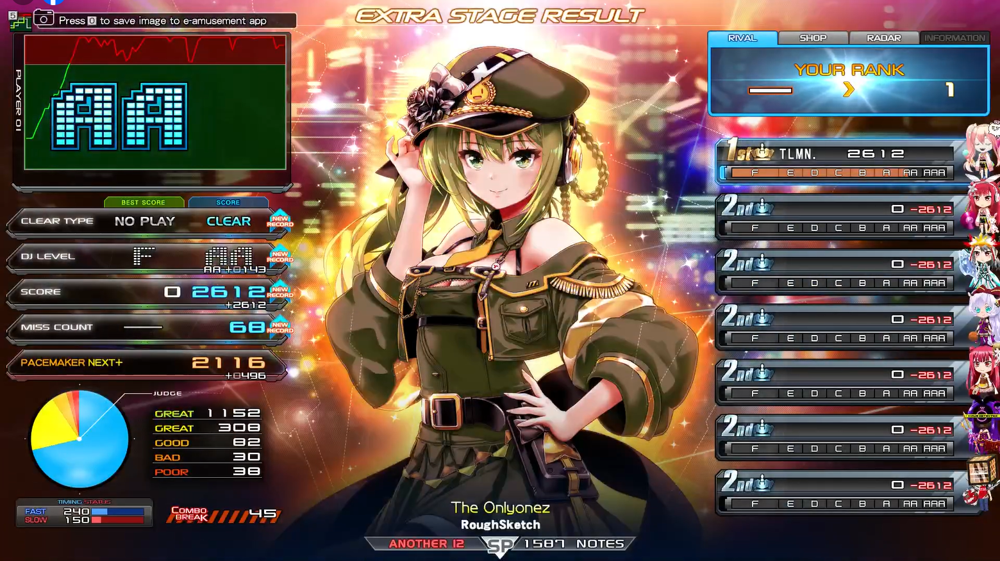

# 
FERVIDEX

> ¡Quiero compartir mis puntajes con el bot!. ¿Cómo puedo hacerlo?

Te explicaremos cómo puedes utilizar el bot que envía puntajes en
#⁠scores, en nuestro servidor de Discord . Realizaremos la guía completa
desde cero. 

> [!NOTE]
> Si ya tienes cuenta en Fervidex, puedes saltar directamente
[a este paso](#poner_tag).

Es requisito que primero juegues en el cab, ya que el enlace para
registrarse exige esto como requisito básico. Luego de haber jugado (y
antes de 30 minutos), debes ingresar a la siguiente [URL](https://fervidex.net/register/arcade/a1FTYm)

Al ingresar, nos mostrará la siguiente pantalla:

En esta pantalla debemos ingresar el código de nuestra card. Es el que
sale la pantalla de inicio al ingresar la tarjeta en el cab. Te dejamos
una imagen de ejemplo:

Ya con eso, podemos seguir el proceso normal de registro. Asegúrate de
usar un correo electrónico al que tengas acceso, ya que no hay otra
forma de recuperar la cuenta si pierdes este correo. En nuestra cuenta, nos encontraremos con las siguientes opciones
en la parte superior. Seleccionaremos la que tiene ícono de tuerca.

Nos dirigiremos a la opción de \"Card sharing\".

Debemos comprobar que nuestra tarjeta está correctamente enlazada con el
arcade \"Entretenimientos Diana\" en el apartado de Sharing with others.
Si ésto ya está listo, podemos seguir adelante. De lo contrario, debemos
seleccionarlo con el buscador y presionar Share.

Ya con el arcade asignado, debemos volver al menú de ajustes que
nombramos en el paso 4 (con el ícono de tuerca) y vamos a la opción
External connections.

Dentro de la opción. Debemos activar el Card image webhook usando la
opción Submit using my in-game profile name and avatar. La URL que nos
pide debe ser solicitada a alguno de los admins del servidor, ya que no
es pública de momento. Teniendo la URL, la pegamos donde lo pide y le
damos a Save.

Ya con ésto podemos compartir nuestros puntajes en el canal de #⁠scores.
Para enviar un puntaje, en la pantalla de resultados (que es la que
adjuntamos como ejemplo aquí abajo) presionamos el botón **9** en el
keypad.

> [!IMPORTANT]
> Algunos puntos a considerar:
> - Cada resultado que envíes será público para todo el servidor. Te
    pedimos **por favor** que seas consciente y no spamees puntajes a lo
    loco. Apelamos a tu criterio para utilizar esta función
    responsablemente.
> - El puntaje que aparezca como **best score** será el mejor puntaje
    que tengas en Fervidex. Si alimentas esta plataforma con puntajes de
    otro lado, ésta siempre mostrará el mejor puntaje que tenga en su
    base de datos y no el que tengas en CG/Diana.
> - **El uso desmedido y/o malintencionado de esta función implica sanciones por parte del staff.**
 

> [!TIP]
> Si necesitas ayuda durante este proceso, no dudes en consultarlo con la comunidad! Todos estamos aquí para ayudar al resto.