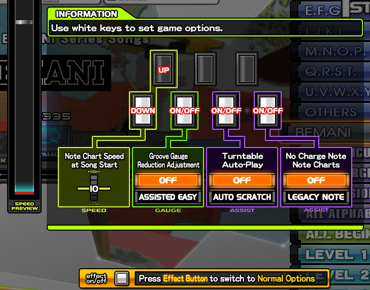
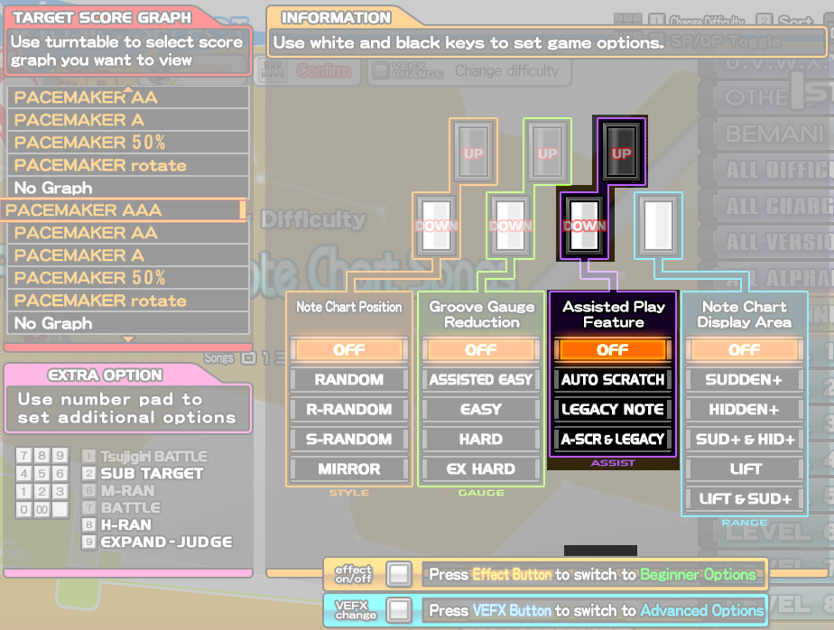

# 
OPCIONES Y OTROS

!!! question "Preguntas a responder"
    - ¿Cuáles son las opciones del juego?, ¿Para qué sirven y cómo puedo cambiarlas?
    - ¿Quieres cambiar el tipo de chart?, ¿Viste que alguien ajustó el timing y también quieres hacerlo?

A continuación hablaremos sobre las opciones disponibles, cómo afectan a tu juego y cómo usarlas a tu favor.
  

━━━━━━━━━━━━━━━━━ ◦ ❖ ◦ ━━━━━━━━━━━━━━━━━

## 
COMO CAMBIAR OPCIONES Y OTRAS COSAS

━━━━━━━━━━━━━━━━━ ◦ ❖ ◦ ━━━━━━━━━━━━━━━━━

En el menú de selección de canción, al apretar el botón **START** te
encontrarás con lo siguiente:

<figure markdown="span">
  
  <figcaption></figcaption>
</figure>

Usando los botones, puedes cambiar distintas opciones según el esquema que nos
muestra en la imagen.

-   Botón 1 y 2: Controlas la velocidad con la que aparecen las
      notas. Mientras mayor sea el número, más rápido irán las notas.
-   Botón 3: Ofrece un reajuste de la barra de vida. La posición **OFF** 
      es la barra por defecto (conocida como GROOVE GAUGE), pero tienes
      una alternativa mas facil llamada ASSISTED EASY, require menos
      vida para completar la canción y es orientada a iniciantes
-   Botón 5: Puedes activar o desactivar el uso del disco.
-   Botón 7: Puedes activar o desactivar el uso de Charge Notes
      (CN).

Este menú se recomienda principalmente para jugadores nuevos, ya que
trae las opciones esenciales para comenzar a familiarizarse con el
juego.

!!! tip "Consejo"
    Si ya comienzas a generar familiaridad con el juego, puedes acceder al menú de opciones normales presionando el botón EFFECT en la parte frontal de la máquina:

<figure markdown="span">
  
  <figcaption></figcaption>
</figure>

Con esto podremos abrir el menú de opciones normales y nos encontraremos
con la siguiente pantalla:

<figure markdown="span">
  
  <figcaption></figcaption>
</figure>

___
Al igual que con las opciones básicas, tendrás acceso a una mayor variedad de modificadores para alterar la canción a gusto

### Tecla 1-2
Podemos activar/desactivar la opción RANDOM o a sus variantes, las cuales se explican mas adelante:

-   OFF: Jugaremos la canción tal y como fue hecha en el juego.

-   RANDOM: Las columnas se moverán en cualquier orden. Por
    ejemplo, el orden normal de un chart, acorde a las columnas, es
    1234567 y RANDOM nos podría entregar patrones como 4653127 o 7546213, etc.
    Si bien las columnas cambian su orden, las notas que están en ellas
    siguen apareciendo en la misma columna.

-   R-RANDOM: Las columnas rotan sin perder el order original en el que venían.
    Siguiendo el mismo ejemplo de antes, R-RANDOM nos
    puede entregar, por ejemplo, un orden como 4567123 o 3456712. Considerando que
    tambien se aplica MIRROR de por medio, también puede quedar como 4321765 o 5432176.

-   S-RANDOM: Las notas se desordenarán en cualquier orden, incluso sin
    depender de la columna. La cantidad de notas permanecerá igual, pero
    éstas no respetarán ningún orden de columnas y, por ende, pueden
    aparecer en cualquiera de éstas, a excepción de notas hechas para el disco.

-   MIRROR: El orden de las columnas de la canción se invierte, es decir, de 1234567 pasa a 7654321.

<figure markdown="span">
  
  <figcaption></figcaption>
</figure>

### Tecla 3-4
Podemos cambiar el tipo de barra con el que jugaremos la canción a elegir:

-   OFF: Laa barra por defecto del juego.
    Esta barra requiere un 80% como mínimo para considerar un
    tema como pasado.

-   ASSISTED EASY: Esta barra requiere un 60% como mínimo para considerar un tema como
    pasado, como también te descuenta menos porcentaje de barra al perder una nota.

-   EASY: Esta barra requiere un 80% para considerar un tema como pasado, pero al fallar descuenta
    un menor porcentaje de barra en comparación al GROOVE GAUGE (es decir, es una
    GROOVE GAUGE pero descuenta menos porcentaje en los fallos), mismo descuento de
    la barra ASSISTED EASY.

-   HARD: Esta barra no requiere un porcentaje mínimo para considerar un tema como pasado, pero si pierdes la
    barra en su totalidad la canción finaliza en el momento, además,
    descuenta más porcentaje de barra en comparación a la GROOVE GAUGE.
    Al tener menos del 30% de vida, se relaja un poco la perdida de vida al conseguir BADs y POORs

-   EX HARD: Esta barra funciona similar que la HARD GAUGE, pero descuenta bastante más porcentaje de barra al
    perder notas, así como tambien, no incluye la reducción de perdida de vida cuando tienes menos de 30%

<figure markdown="span">
  
  <figcaption></figcaption>
</figure>

### Tecla 5-6
Podemos elegir distintos tipos de "ayuda" mientras jugamos.

-   AUTO SCRATCH: Los discos cambiarán de color a verde o desapareceran acorde a la configuración del usuario,
    y se jugarán automáticamente.

-   LEGACY NOTE: Todas las Charge Notes (CN) cambiarán a notas normales.

-   A-SCR & LEGACY: Ambas opciones juntas (AUTO SCRATCH y LEGACY NOTE).

<figure markdown="span">
  
  <figcaption></figcaption>
</figure>

### Tecla 7
Podemos elegir distintas visualizaciones para acomodar lo mejor posible nuestro gameplay. Lo más común es utilizar SUDDEN+, o también LIFT, o ambas.

-   SUDDEN+: Nos desplegará una cubierta desde la parte superior de la
    pantalla. Lo podemos ajustar manteniendo presionada la tecla START y
    girando el disco.

-   HIDDEN+: Nos desplegará un cubierta desde la parte inferior de la
    pantalla. Se ajusta de la misma forma que SUDDEN+.

-   SUD+ & HID+: Ambas opciones juntas, es decir, tendremos una cubierta
    tanto en la parte superior como en la inferior.

-   LIFT: Es similar al HIDDEN+, pero la diferencia es que moverá la
    "judgement line", es decir, la línea roja donde debemos presionar
    las notas. Usualmente ésto se usa cuando quieres tener el gameplay
    más arriba para más comodidad a la hora de jugar.

-   LIFT & SUD+: Activa la opción LIFT y SUDDEN+ juntas.

Para ajustar tanto el HIDDEN+ como el LIFT, debemos desactivar
temporalmente la opción SUDDEN+ presionando rápidamente el botón START
dos veces, ajustamos con el disco mientras mantenemos el START y luego
volvemos a activar SUDDEN+ presionando nuevamente el botón START dos
veces.

### PACEMAKER
Podemos activar un gráfico que se mostrará del lado opuesto de la pantalla al que estamos jugando. Se utiliza frecuentemente para comparar en tiempo real el cómo vamos jugando en comparación a lo que hayamos seleccionado.

-   PACEMAKER AAA/AA/A: Nos comparará nuestro puntaje actual contra un
    puntaje "esperado" para conseguir la calificación deseada.

    PACEMAKER NEXT/NEXT+: Nos comparará nuestro puntaje actual frente a
    un puntaje un poco mejor que el que ya teníamos en la canción.

    El resto de opciones sirven para comparar de otras formas, pero ya
    queda en ustedes descubrir cómo funcionan y si les acomoda. Además,
    al activar el PACEMAKER veremos 3 barras de colores, en las cuales
    veremos 3 puntajes distintos:

    -   BARRA AZUL: Nuestro puntaje actual.

    -   BARRA VERDE: Nuestro mejor puntaje, conocido como Personal Best
        (PB)

    -   BARRA ROJA: Es el PACEMAKER que elegimos previamente.

<figure markdown="span">
  
  <figcaption></figcaption>
</figure>

Además, puedes presionar la tecla START del lado contrario para cambiar
la posición del gráfico. Es decir, si juegas en el PLAYER 1 (lado
izquierdo) puedes presionar la tecla START del PLAYER 2 para cambiar el
gráfico de posición y viceversa. El gráfico en otra posición queda tal
cual lo muestra la siguiente imagen:

<figure markdown="span">
  
  <figcaption></figcaption>
</figure>